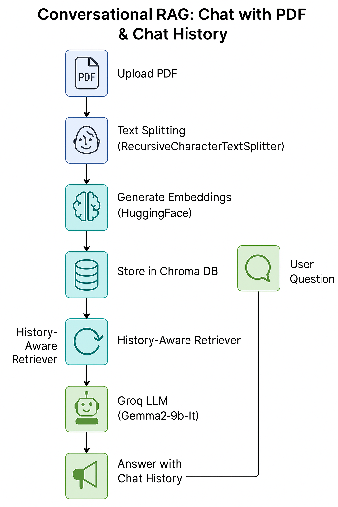

# Conversational RAG with PDF Uploads and Chat History

A Streamlit-based Retrieval-Augmented Generation (RAG) application that allows users to upload PDF documents and engage in conversational Q&A with persistent chat history.

## Features

- **PDF Document Upload**: Support for multiple PDF file uploads
- **Conversational AI**: Chat interface powered by Groq's Gemma2-9b-It model
- **Chat History**: Maintains conversation context across sessions
- **Document Retrieval**: Uses vector embeddings for intelligent document search
- **Session Management**: Support for multiple conversation sessions

## Prerequisites

- Python 3.8+
- Groq API key
- HuggingFace token (optional, for embeddings)

## Installation

1. Clone the repository:
```bash
git clone <your-repo-url>
cd <RAG-Q&A-Conversation>
```

2. Install required dependencies:
```bash
pip install streamlit langchain langchain-community langchain-groq langchain-huggingface
pip install chromadb pypdf python-dotenv
```

3. Set up environment variables:
Create a `.env` file in the root directory:
```env
HF_TOKEN=your_huggingface_token_here
```

## Usage

1. Start the Streamlit application:
```bash
streamlit run app.py
```

2. Open your browser and navigate to the provided local URL (typically `http://localhost:8501`)

3. Enter your Groq API key in the password field

4. (Optional) Set a custom Session ID for your conversation

5. Upload one or more PDF documents using the file uploader

6. Start asking questions about the uploaded documents

## Architecture Overview



*The above diagram illustrates the complete workflow from PDF upload to conversational responses with maintained chat history.*

## How It Works

### RAG Workflow

The application follows this sequential workflow:

1. **PDF Upload**: Users upload PDF documents through the Streamlit interface
2. **Text Splitting**: Documents are split into manageable chunks using RecursiveCharacterTextSplitter
3. **Embedding Generation**: Text chunks are converted to vector embeddings using HuggingFace models
4. **Vector Storage**: Embeddings are stored in Chroma database for efficient retrieval
5. **History-Aware Retrieval**: User questions are contextualized with chat history
6. **LLM Processing**: Groq's Gemma2-9b-It model generates responses based on retrieved context
7. **Response with History**: Answers are provided while maintaining conversation context

### Document Processing
- PDFs are loaded using PyPDFLoader
- Documents are split into chunks (5000 characters with 500 character overlap)
- Text chunks are converted to embeddings using HuggingFace's "all-MiniLM-L6-v2" model
- Embeddings are stored in a Chroma vector database

### Conversational RAG Chain
1. **History-Aware Retrieval**: Reformulates user questions based on chat history
2. **Document Retrieval**: Searches relevant document chunks using vector similarity
3. **Answer Generation**: Uses retrieved context and chat history to generate responses
4. **Session Management**: Maintains separate chat histories for different sessions

### Key Components

- **LLM**: Groq's Gemma2-9b-It model for text generation
- **Embeddings**: HuggingFace all-MiniLM-L6-v2 for document vectorization
- **Vector Store**: Chroma for efficient similarity search
- **Chat History**: LangChain's ChatMessageHistory for conversation persistence

## Configuration

### Model Parameters
- **Chunk Size**: 5000 characters
- **Chunk Overlap**: 500 characters
- **Response Length**: Maximum 3 sentences (configurable in system prompt)

### API Requirements
- **Groq API Key**: Required for LLM access
- **HuggingFace Token**: Optional, may improve embedding model access

## File Structure

```
project/
├── app.py                 # Main Streamlit application
├── .env                   # Environment variables
├── requirements.txt       # Python dependencies
├── temp.pdf              # Temporary file for PDF processing
└── README.md             # This file
```

## Dependencies

```txt
streamlit
langchain
langchain-community
langchain-groq
langchain-huggingface
chromadb
pypdf
python-dotenv
```

## Troubleshooting

### Common Issues

1. **API Key Errors**: Ensure your Groq API key is valid and has sufficient credits
2. **PDF Upload Issues**: Check that uploaded files are valid PDFs
3. **Memory Issues**: Large PDFs may require more system memory
4. **Embedding Errors**: Verify HuggingFace token if encountering model download issues

### Performance Tips

- For better performance with large documents, consider reducing chunk size
- Use session IDs to organize different conversation topics
- Clear chat history periodically to improve response speed

## Limitations

- Temporary PDF files are created during processing
- Vector store is recreated for each session (not persistent)
- Limited to PDF documents only
- Response length is constrained to 3 sentences

## Contributing

1. Fork the repository
2. Create a feature branch
3. Make your changes
4. Submit a pull request

